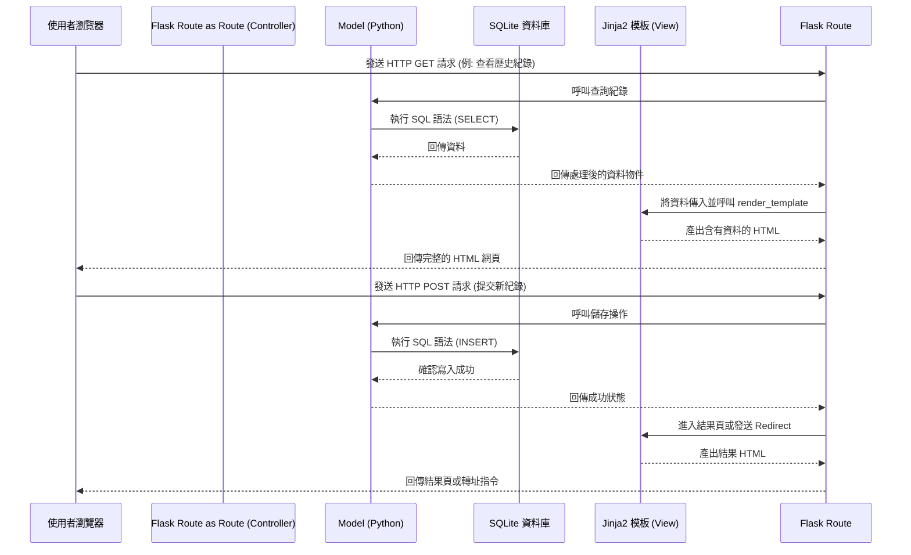

# 線上算命系統架構設計

## 1. 技術架構說明

根據產品需求文件 (PRD) 與技術限制，我們的系統不採用前後端分離，而是利用 Python Flask 搭配 Jinja2 進行全端渲染 (Server-Side Rendering) 開發。

### 選用技術與原因
- **後端框架：Python Flask**
  輕量化、學習曲線平緩，非常適合這類不需要繁重複雜架構的小中型專案。
- **模板引擎：Jinja2**
  與 Flask 完美整合，允許開發者在 HTML 內使用 Python 語法撰寫簡單邏輯（如：迴圈、條件判斷），適合快速構建動態網頁。
- **資料庫：SQLite**
  透過檔案型資料庫即可滿足初期資料存儲需求（包含使用者資料、抽籤記錄、籤詩題庫）。部署容易且零配置。前端介面也直接整合，不需要額外維護獨立的資料庫伺服器。
- **前端呈現：HTML / Vanilla CSS / Vanilla JavaScript**
  在盡可能不增加外部依賴的狀況下維持系統的輕巧性，確保網頁載入速度。

### Flask MVC 模式說明
雖然 Flask 本身是微框架不強制規範架構，但為了專案好維護，我們將採取類似 MVC (Model-View-Controller) 的架構來組織：
- **Model (資料模型)**：負責定義資料庫的表格結構、負責與 SQLite 進行資料的讀寫操作（未來可透過 SQLAlchemy 實作）。
- **View (視圖)**：負責呈現使用者介面，這裡指的是 Jinja2 的 HTML 模板。
- **Controller (控制器)**：在 Flask 裡對應 `routes`，負責接收瀏覽器的請求 (Request)，呼叫 Model 處理資料，並將資料轉交給 View 來生成最終要回傳的網頁。

---

## 2. 專案資料夾結構

為了保持專案結構的清晰好維護，將採用下列目錄規劃：

```text
web_app_development/
├── app/                      # 應用程式的主目錄
│   ├── __init__.py           # Flask app 的初始化與設定
│   ├── models/               # Model (資料庫模型)
│   │   ├── __init__.py
│   │   ├── user.py           # 會員資料模型
│   │   ├── fortune.py        # 抽籤與籤詩資料模型
│   │   └── history.py        # 使用者歷史紀錄模型
│   ├── routes/               # Controller (Flask 路由)
│   │   ├── __init__.py
│   │   ├── auth.py           # 負責註冊、登入登出路由
│   │   ├── main.py           # 負責首頁、抽籤等核心流程路由
│   │   └── api.py            # (選擇性) 若有提供給頁面的 AJAX 介面可放在這
│   ├── templates/            # View (Jinja2 HTML 模板)
│   │   ├── base.html         # 母版 (包含共用的 head, header, footer)
│   │   ├── index.html        # 首頁
│   │   ├── login.html        # 登入/註冊頁面
│   │   ├── fortune.html      # 抽籤/結果頁面
│   │   └── history.html      # 歷史紀錄查閱頁面
│   └── static/               # CSS / JS 等靜態資源
│       ├── css/
│       │   └── style.css     # 主樣式表
│       ├── js/
│       │   └── main.js       # 全域 JavaScript 或抽籤動畫邏輯
│       └── images/           # 網站圖片與 Icon
├── instance/                 # 存放不需進版控的敏感/變動檔案
│   └── database.db           # SQLite 資料庫實體檔案 (不應 commit 到 git)
├── docs/                     # 開發文件 (PRD, 架構圖等)
├── .gitignore                # 指定 Git 略過的檔案清單
├── requirements.txt          # Python 依賴套件清單
└── run.py                    # 專案啟動入口 (主程式)
```

---

## 3. 元件關係圖

以下使用 Mermaid 語法來說明使用者的請求是怎麼流經系統的：



---

## 4. 關鍵設計決策

1. **統一透過 `run.py` 啟動專案：**
   將程式進入點與 app 初始化的邏輯拆分，這能確保專案架構更容易擴展，未來若希望增加其他指令（如資料庫初始化的 script）時也比較好管理。
2. **Blueprints 路由拆分：**
   雖然目前專案規模不大，但仍將 `routes` 拆分為 `auth.py` 和 `main.py` 等模組。這是為了避免未來所有程式碼都塞在同一個檔案內難以維護。這必須依賴 Flask 的 Blueprint 功能實作。
3. **Template 繼承機制 (`base.html`)：**
   Jinja2 強大的模板繼承是我們優化開發的重點。所有頁面都會繼承 `base.html`，統一導航列（Navigation Bar）與頁尾設計，確保修改全站主視覺時可以一改全改。
4. **採用 `instance` 資料夾管理資料庫檔案：**
   這是一個安全性和實務考量，`instance` 內的檔案（包含 SQLite DB）不會也不能被推送到版本控制去。這確保測試環境的髒資料或使用者的機敏資料不致外洩。
