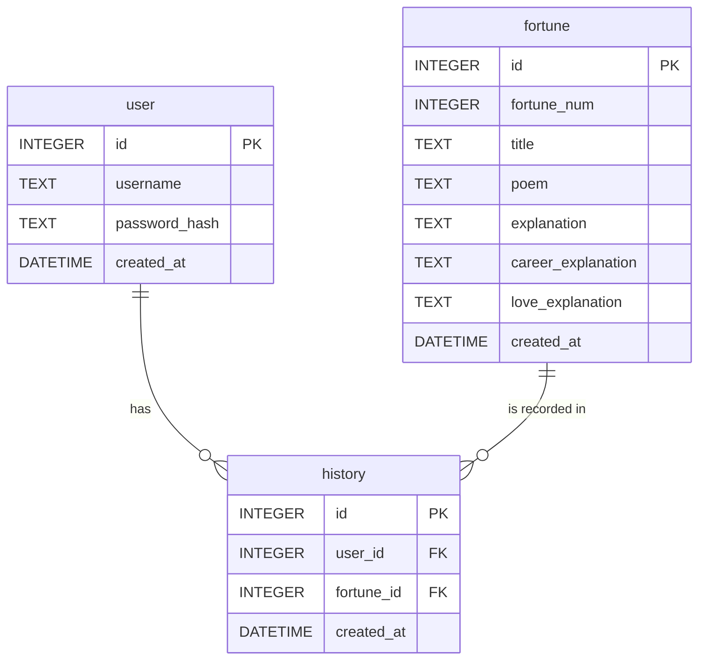

# DB Design - 資料庫設計

本文件根據 PRD 與系統架構，定立 SQLite 資料表的欄位、型別與關聯。

## 1. ER 圖（實體關係圖）

## 2. 資料表詳細說明

### user (使用者表)
儲存註冊會員的資料。
- `id` (INTEGER): Primary Key, 自動遞增。
- `username` (TEXT): 使用者帳號名稱，必須唯一且必填。
- `password_hash` (TEXT): 加密後的密碼，必填。
- `created_at` (DATETIME): 帳號建立時間，預設為當前系統時間。

### fortune (籤詩庫表)
儲存所有籤詩與其解析內容。
- `id` (INTEGER): Primary Key, 自動遞增。
- `fortune_num` (INTEGER): 籤號 (第幾籤)，必填。
- `title` (TEXT): 籤詩標題或吉凶 (如：大吉、中吉)，必填。
- `poem` (TEXT): 籤詩原文，必填。
- `explanation` (TEXT): 白話文整體解析，必填。
- `career_explanation` (TEXT): 事業運解析。
- `love_explanation` (TEXT): 感情運解析。
- `created_at` (DATETIME): 資料建立時間，預設為當前系統時間。

### history (歷史紀錄表)
紀錄使用者每一次抽籤的結果。
- `id` (INTEGER): Primary Key, 自動遞增。
- `user_id` (INTEGER): Foreign Key，關聯至 `user`.`id`，必填。
- `fortune_id` (INTEGER): Foreign Key，關聯至 `fortune`.`id`，必填。
- `created_at` (DATETIME): 抽籤時間，預設為當前系統時間。

## 3. SQL 建表語法

請參考 `database/schema.sql`，可利用該檔案直接初始化系統所需的空資料表。
