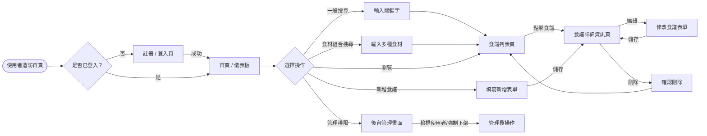
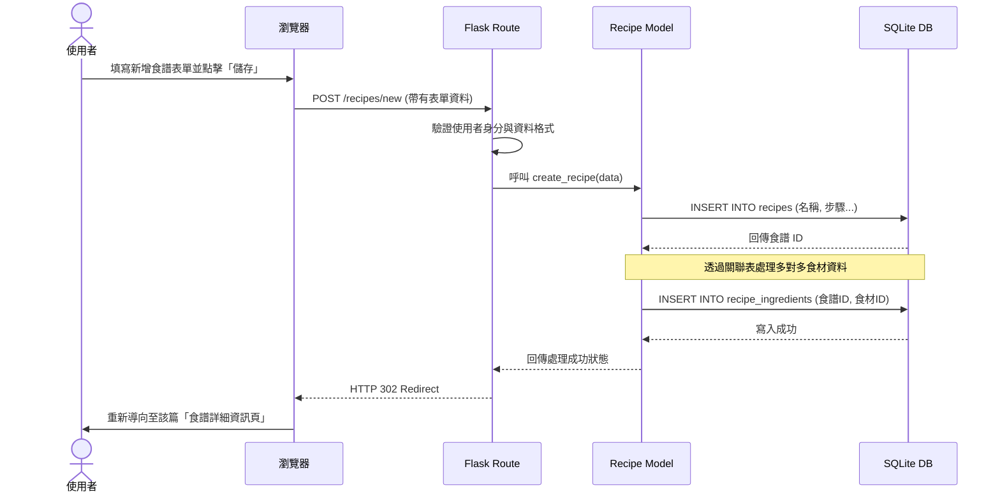

# 系統流程圖與功能對照表

本文件依據 PRD 與系統架構規劃，定義使用者的操作動線以及系統內部的資料流程。

## 1. 使用者流程圖（User Flow）

描述使用者從進入系統到執行主要功能（註冊登入、搜尋、CRUD 等）的完整操作路徑。

## 2. 系統序列圖（Sequence Diagram）

以下描述「使用者填寫新食譜並送出」到「資料存入資料庫」的完整流程。

## 3. 功能清單與路由對照表

以下整理系統主要功能、預期的網址路徑 (URL) 以及對應的 HTTP 請求方法。

| 功能名稱 | URL 路徑 | HTTP 方法 | 說明 |
| :--- | :--- | :---: | :--- |
| **首頁 / 列表** | `/` 或 `/recipes` | GET | 顯示食譜列表，支援一般關鍵字搜尋與食材組合搜尋。 |
| **註冊帳號** | `/auth/register` | GET, POST | 顯示註冊表單，處理註冊邏輯並存入使用者資料。 |
| **登入系統** | `/auth/login` | GET, POST | 顯示登入表單，驗證帳號密碼並建立 session。 |
| **登出系統** | `/auth/logout` | GET (或 POST) | 清除 session，並重導向回首頁或登入頁。 |
| **新增食譜** | `/recipes/new` | GET, POST | GET 顯示表單；POST 處理並寫入新食譜與食材資料。 |
| **食譜詳細資訊** | `/recipes/<id>` | GET | 檢視該筆食譜的所有內容、步驟與所需食材。 |
| **編輯食譜** | `/recipes/<id>/edit` | GET, POST | GET 顯示帶有原資料的表單；POST 更新內容至資料庫。 |
| **刪除食譜** | `/recipes/<id>/delete`| POST | 將該筆食譜自資料庫中移除（僅限原作者或管理員）。 |
| **後台：管理面板**| `/admin` | GET | 顯示全站資訊概覽（僅限管理員）。 |
| **後台：用戶清單**| `/admin/users` | GET | 檢視所有註冊用戶清單。 |
