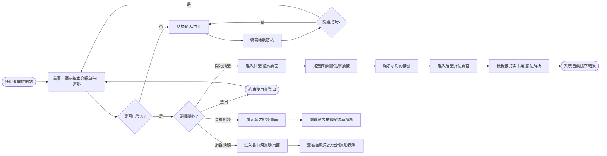
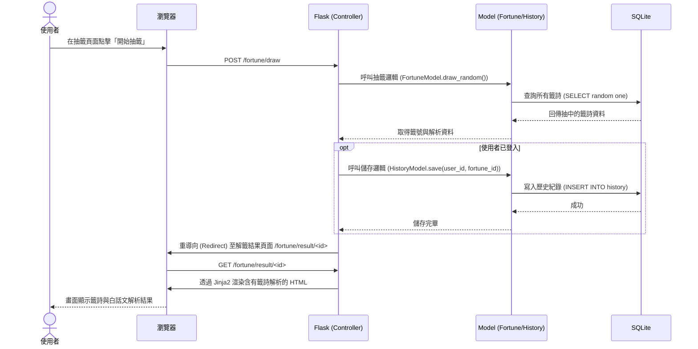

# 線上算命系統 - 流程圖與對照表

本文件根據專案的 PRD 與架構設計，繪製了使用者的操作流程圖（User Flow），以及核心功能的系統序列圖（Sequence Diagram），最後附上各功能與預計路由的路徑對照表。

## 1. 使用者流程圖（User Flow）

描述使用者從進入系統到操作各項主要功能的完整路徑。

## 2. 系統序列圖（Sequence Diagram）

此序列圖描述核心功能：「使用者點擊抽籤」一直到「獲得詳細解籤並儲存在資料庫」的完整資料流。

## 3. 功能清單對照表

根據 PRD 提出的功能，對應預計實作的 URL 路徑與發送的 HTTP 方法：

| 功能需求 | 對應介面 / 操作 | HTTP 方法 | URL 路徑 (預計) |
| -------- | --------------- | --------- | --------------- |
| 1. 首頁/每日運勢 | 顯示系統首頁與當日簡易運勢 | GET | `/` |
| 2. 會員註冊 | 進入註冊頁面 | GET | `/auth/register` |
| | 送出註冊資料 | POST | `/auth/register` |
| 3. 會員登入 | 進入登入頁面 | GET | `/auth/login` |
| | 送出登入資料 | POST | `/auth/login` |
| 4. 會員登出 | 執行登出操作 | GET | `/auth/logout` |
| 5. 算命抽籤 | 進入抽籤儀式頁面 | GET | `/fortune` |
| | 執行隨機抽籤操作 | POST | `/fortune/draw` |
| 6. 靈籤解析 | 顯示單一籤詩的詳細解析結果 | GET | `/fortune/result/<fortune_id>` |
| 7. 儲存/查詢紀錄 | 查看自己的歷史抽籤結果列表 | GET | `/history` |
| 8. 捐香油錢 | 顯示贊助資訊與表單 | GET | `/donate` |
